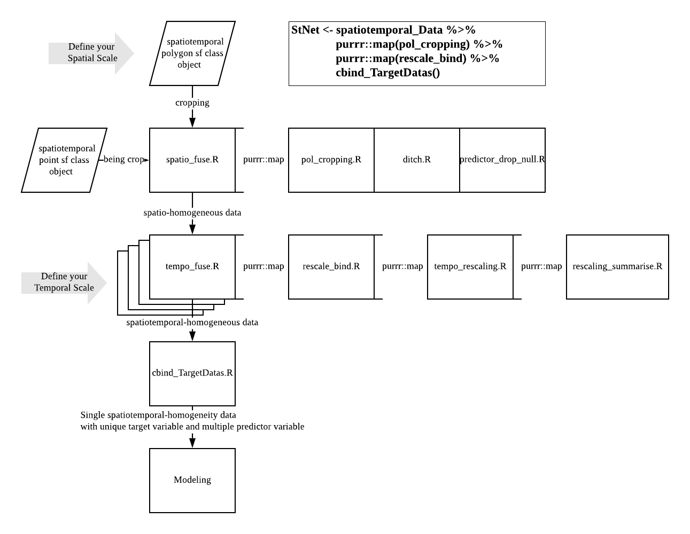

<!-- README.md is generated from README.Rmd. Please edit that file -->

# stNet

<!-- badges: start -->

<!-- badges: end -->

The goal of stNet is to remove the heterogeneity bewteen spatiotemporal
data by fusing the spatial and temporal feature with mapping to the
desired scale.

## Installation

You can install the released version of stNet from
[CRAN](https://CRAN.R-project.org) with:

``` r
devtools::install_github("WeiquanLuo/stNet")
# install.packages("stNet") # not yet avaliable
```

## Workflow

<center>



</center>

## Example

This is a basic example which shows a workflow of using \(stNet\)
functionality:

``` r
library(stNet)
# load data
data(corn_yield_sf); corn_yield_st <- corn_yield_sf # polygon sf object
data(weather_tmin_sf); weather_tmin_st <- weather_tmin_sf # point sf object
data(water_Temperature_sf); water_Temperature_st <- water_Temperature_sf # point sf object

# Visualization the data
plot(sf::st_geometry(corn_yield_st))
plot(sf::st_geometry(weather_tmin_st), col = "blue", add = TRUE)
plot(sf::st_geometry(water_Temperature_st), col = "red", add = TRUE)
```


### Step 1 fuse the spatio heterogeneity: `spatio_fuse()`

``` r
yield_tmin_t <- spatio_fuse(target_stN = corn_yield_st,
                            data_stN = weather_tmin_st,
                            parm_nm = "tmin",
                            crs = 2163)
#> Linking to GEOS 3.7.2, GDAL 2.4.2, PROJ 5.2.0

yield_watertem_t <- spatio_fuse(target_stN = corn_yield_st,
                                data_stN = water_Temperature_st,
                                parm_nm = "watertem",
                                crs = 2163)
yield_watertem_t
#> # A tibble: 15 x 3
#>    county                target predictor           
#>    <chr>         <list<df[,2]>> <list>              
#>  1 bremer              [39 × 2] <tibble [2,582 × 2]>
#>  2 clayton             [39 × 2] <tibble [1,386 × 2]>
#>  3 clinton             [39 × 2] <tibble [2,215 × 2]>
#>  4 dallas              [39 × 2] <tibble [2,389 × 3]>
#>  5 dickinson           [39 × 2] <tibble [2,648 × 3]>
#>  6 fremont             [39 × 2] <tibble [1,035 × 2]>
#>  7 greene              [39 × 2] <tibble [2,298 × 2]>
#>  8 hamilton            [39 × 2] <tibble [2,339 × 2]>
#>  9 linn                [39 × 2] <tibble [1,739 × 2]>
#> 10 marion              [39 × 2] <tibble [2,544 × 2]>
#> 11 page                [39 × 2] <tibble [2,269 × 2]>
#> 12 polk                [39 × 2] <tibble [1,921 × 2]>
#> 13 pottawattamie       [38 × 2] <tibble [3,264 × 2]>
#> 14 sac                 [39 × 2] <tibble [2,345 × 2]>
#> 15 woodbury            [39 × 2] <tibble [2,611 × 2]>
yield_watertem_t$target[[1]]
#> # A tibble: 39 x 2
#>     Year yield
#>    <int> <dbl>
#>  1  2018  212.
#>  2  2017  213.
#>  3  2016  211.
#>  4  2015  203.
#>  5  2014  159 
#>  6  2013  175.
#>  7  2012  133.
#>  8  2011  196.
#>  9  2010  175.
#> 10  2009  189.
#> # … with 29 more rows
yield_watertem_t$predictor[[1]]
#> # A tibble: 2,582 x 2
#>    Date       watertem_05458300
#>    <date>                 <dbl>
#>  1 2011-10-01              13.5
#>  2 2011-10-02              12.9
#>  3 2011-10-03              13.7
#>  4 2011-10-04              14.6
#>  5 2011-10-05              15.5
#>  6 2011-10-06              16.1
#>  7 2011-10-07              16.5
#>  8 2011-10-08              17.2
#>  9 2011-10-09              17.5
#> 10 2011-10-10              16.8
#> # … with 2,572 more rows
```

### Step 2: fuse temporal heterogeneity: `tempo_fuse()`

``` r
yield_tmin <- tempo_fuse(target_data = yield_tmin_t,
                          date_col = c("Year", "Date"),
                          scaling = c("Year","Month"),
                          aggMethod = c("mean","min"))

yield_watertem <- tempo_fuse(target_data = yield_watertem_t,
                          date_col = c("Year", "Date"),
                          scaling = c("Year","Month"),
                          aggMethod = c("mean","min"))
yield_watertem
#> # A tibble: 15 x 2
#>    county        data              
#>    <chr>         <list>            
#>  1 bremer        <tibble [39 × 14]>
#>  2 clayton       <tibble [39 × 14]>
#>  3 clinton       <tibble [39 × 14]>
#>  4 dallas        <tibble [39 × 26]>
#>  5 dickinson     <tibble [39 × 26]>
#>  6 fremont       <tibble [39 × 14]>
#>  7 greene        <tibble [39 × 14]>
#>  8 hamilton      <tibble [39 × 14]>
#>  9 linn          <tibble [39 × 14]>
#> 10 marion        <tibble [39 × 14]>
#> 11 page          <tibble [39 × 14]>
#> 12 polk          <tibble [39 × 14]>
#> 13 pottawattamie <tibble [38 × 14]>
#> 14 sac           <tibble [39 × 14]>
#> 15 woodbury      <tibble [39 × 14]>
yield_watertem$data[[1]]
#> # A tibble: 39 x 14
#>     Year yield watertem_054583… watertem_054583… watertem_054583…
#>    <dbl> <dbl>            <dbl>            <dbl>            <dbl>
#>  1  2018  212.                1              0.1             -0.1
#>  2  2017  213.                1              1               -0.1
#>  3  2016  211.                1              1               -0.2
#>  4  2015  203.                1              1               -0.1
#>  5  2014  159                 1             -0.1             -0.1
#>  6  2013  175.                1              0               -0.1
#>  7  2012  133.                1              0.7              0.5
#>  8  2011  196.                1              1               -0.1
#>  9  2010  175.               NA             NA               NA  
#> 10  2009  189.               NA             NA               NA  
#> # … with 29 more rows, and 9 more variables: watertem_05458300_1 <dbl>,
#> #   watertem_05458300_2 <dbl>, watertem_05458300_3 <dbl>,
#> #   watertem_05458300_4 <dbl>, watertem_05458300_5 <dbl>,
#> #   watertem_05458300_6 <dbl>, watertem_05458300_7 <dbl>,
#> #   watertem_05458300_8 <dbl>, watertem_05458300_9 <dbl>
```

### Step 3: bind multiple homogeneous spatiotemporal data into a single object

If there multiple parameter for the same target varible, we can use
`cbind_TargetDatas()` to join them. For example, joining two objects
`yield_tmin` and `yield_tmax` by `join_by = "Year"` with anchoring the
target varialbe `target = "yield"`:

``` r

bind_data <- cbind_TargetDatas(yield_tmin, yield_watertem, 
                               target = "yield", join_by = "Year"); bind_data; bind_data$data[[1]]
#> # A tibble: 90 x 2
#>    county     data              
#>    <chr>      <list>            
#>  1 adair      <tibble [39 × 14]>
#>  2 adams      <tibble [39 × 14]>
#>  3 allamakee  <tibble [39 × 14]>
#>  4 appanoose  <tibble [38 × 26]>
#>  5 audubon    <tibble [39 × 14]>
#>  6 benton     <tibble [39 × 26]>
#>  7 blackhawk  <tibble [39 × 14]>
#>  8 boone      <tibble [39 × 26]>
#>  9 bremer     <tibble [39 × 26]>
#> 10 buenavista <tibble [39 × 26]>
#> # … with 80 more rows
#> # A tibble: 39 x 14
#>     Year yield tmin_USC0013343… tmin_USC0013343… tmin_USC0013343…
#>    <dbl> <dbl>            <dbl>            <dbl>            <dbl>
#>  1  2018  149.             -306             -211              -94
#>  2  2017  175.             -211             -167             -133
#>  3  2016  190.             -233             -178             -111
#>  4  2015  176.             -228             -239             -200
#>  5  2014  169.             -261             -256             -228
#>  6  2013  138.             -189             -228             -117
#>  7  2012  104.             -189             -200              -89
#>  8  2011  153.             -206             -261             -133
#>  9  2010  139.             -289             -267             -106
#> 10  2009  179.             -289             -189             -161
#> # … with 29 more rows, and 9 more variables: tmin_USC00133438_4 <dbl>,
#> #   tmin_USC00133438_5 <dbl>, tmin_USC00133438_6 <dbl>,
#> #   tmin_USC00133438_7 <dbl>, tmin_USC00133438_8 <dbl>,
#> #   tmin_USC00133438_9 <dbl>, tmin_USC00133438_10 <dbl>,
#> #   tmin_USC00133438_11 <dbl>, tmin_USC00133438_12 <dbl>
```

### Afterword: Fit Your Model\!

After fusing the spatial and temporal heterogeneity of the data, you can
use other generic modeling technique to do analysis. For example:

``` r
# fitmodel = lm
fitmodel <- function(data){
  model <- lm(yield ~ ., data=data %>% na.omit() %>% dplyr::select(-Year))
  return(model)
}
F_model <- yield_tmin %>%
  dplyr::mutate(model = data %>% purrr::map(fitmodel)) %>% 
  dplyr::mutate(statisics = model %>% purrr::map(.f = function(m) broom::glance(m))) %>%
  tidyr::unnest(statisics); F_model
#> # A tibble: 89 x 14
#>    county data  model r.squared adj.r.squared sigma statistic p.value    df
#>    <chr>  <lis> <lis>     <dbl>         <dbl> <dbl>     <dbl>   <dbl> <int>
#>  1 adair  <tib… <lm>      0.353        0.152   27.9     1.76  0.121      10
#>  2 adams  <tib… <lm>      0.559        0.406   22.9     3.66  0.00454    10
#>  3 allam… <tib… <lm>      0.528        0.304   26.2     2.36  0.0551     10
#>  4 appan… <tib… <lm>      0.645        0.309   31.4     1.92  0.0839     19
#>  5 audub… <tib… <lm>      0.227       -0.0209  33.8     0.916 0.526      10
#>  6 benton <tib… <lm>      0.488        0.0281  35.6     1.06  0.446      19
#>  7 black… <tib… <lm>      0.491        0.333   27.6     3.11  0.00972    10
#>  8 boone  <tib… <lm>      0.638        0.312   24.9     1.96  0.0741     19
#>  9 bremer <tib… <lm>      0.503        0.309   28.2     2.59  0.0316     10
#> 10 buena… <tib… <lm>      0.714        0.396   23.8     2.25  0.0448     21
#> # … with 79 more rows, and 5 more variables: logLik <dbl>, AIC <dbl>,
#> #   BIC <dbl>, deviance <dbl>, df.residual <int>
```
